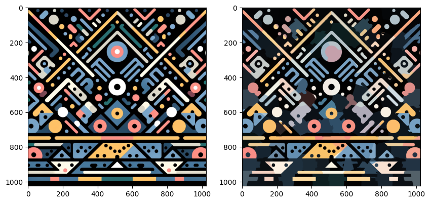
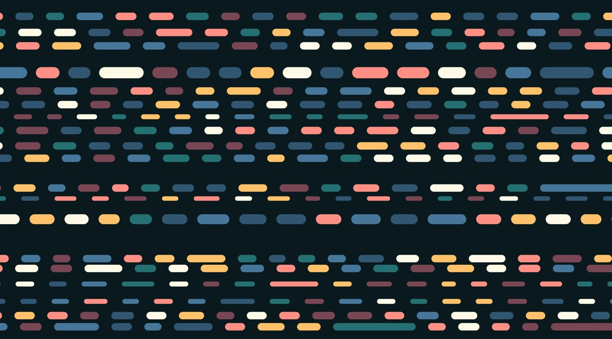
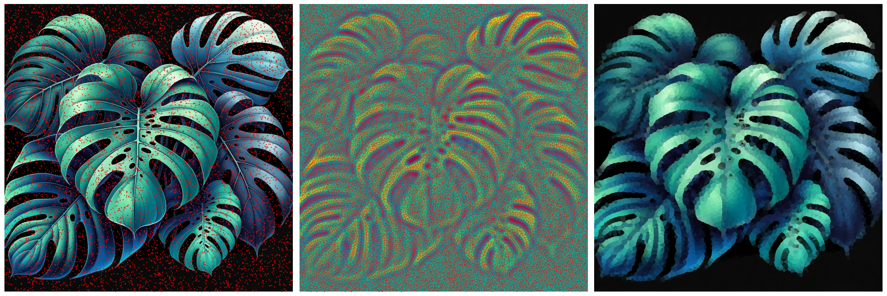
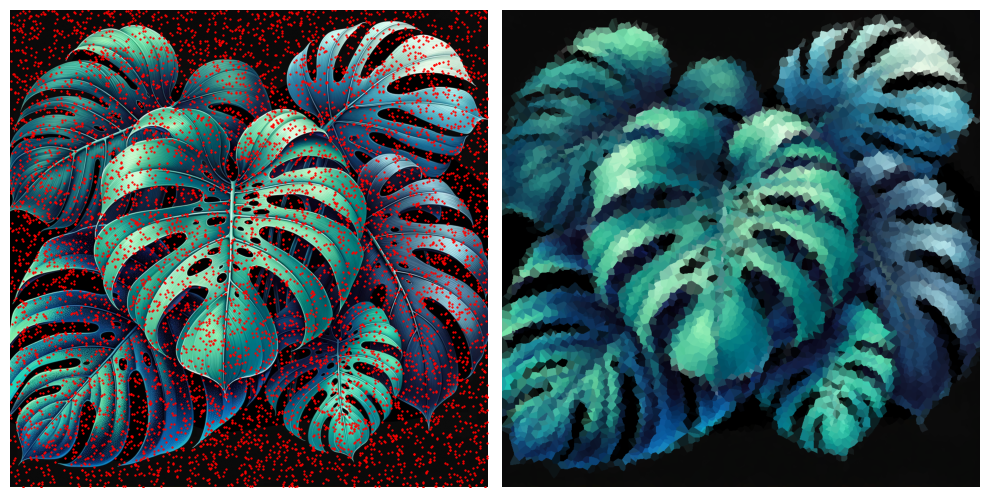

# Voronoi Pixelate

This repo contains some experiments I did trying to create a desktop background.

The following sections summarise the output of the notebooks;

## 01 - K-Means Clustering on Image

Failed attempt to extract color patches using K-Means;

I was really hoping to get this to cleanly extract each coloured area, but this
turns out to be more difficult than expected. Maybe I can get it right in the
future.

## 02 - Line Dash Generator

## 03 - Voronoi Effect

### Output

The following output shows how the random point locations get adjusted based on
the image data using a "force field" and repulsion between points:

### Without Simulaiton

For comparison, the following image shows the same effect, but without the
secret-sauce-simulation thingo

